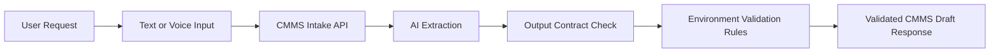
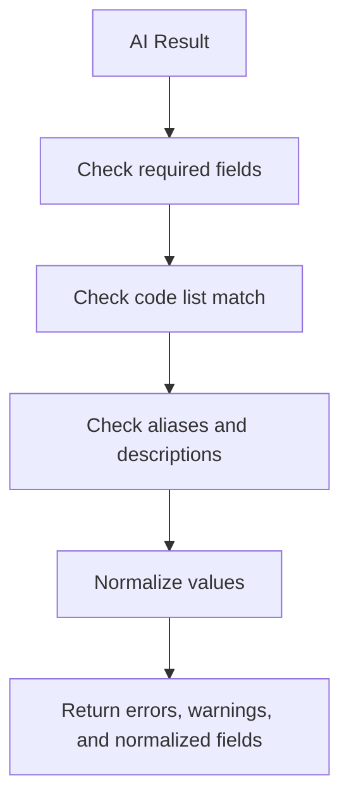
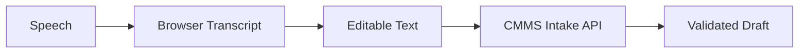
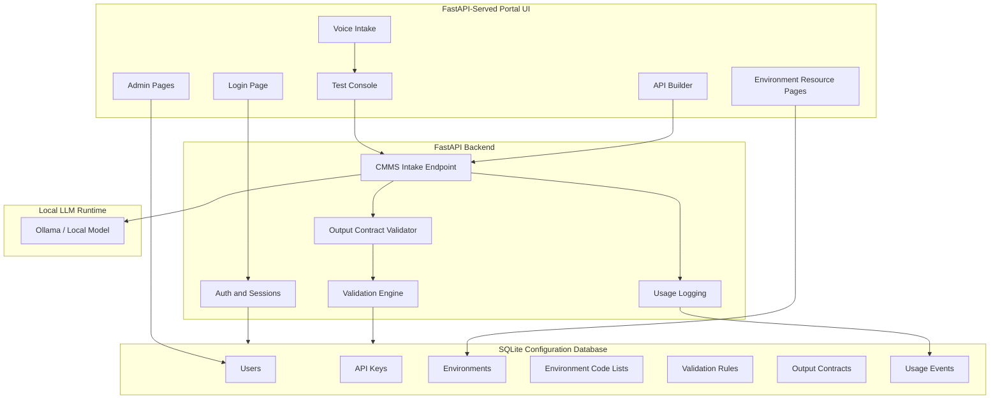
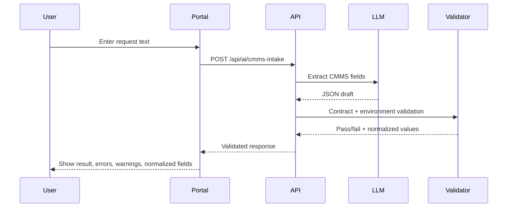
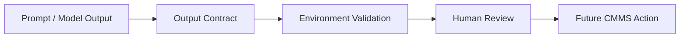

# CMMS Local AI API Management Console

A local-first AI API management console for CMMS work-request intake, environment-specific validation, API testing, and controlled LLM output review.

> **External Demo URL:** `https://<your-cloudflare-tunnel-url>`  
> Replace this placeholder with the Cloudflare public URL after deployment.

---

## 1. Project Overview

This project converts a basic local AI API test page into a full **CMMS AI API Management Console**.

The system is designed for organizations that want to test and manage AI-assisted CMMS intake without immediately writing back to a live CMMS database. It provides a controlled management layer around local LLM calls, environment-specific code lists, validation rules, API keys, user access, test tools, and operational logs.

The core idea is simple:



The project is not a work-order creation engine. It is an AI-assisted **draft, validation, and API testing layer**.

---

## 2. Why This Project Matters

Most CMMS systems depend on structured fields:

- Building
- Room
- Priority
- Work order type
- Assign-to
- Issue-to
- Job type
- Custom site-specific codes

Natural-language AI can extract these values, but raw model output is not enough. A useful CMMS AI layer must verify that extracted values match the customer’s configured environment.

This project solves that problem by combining:

1. **Environment-specific code lists**
2. **Validation rules**
3. **AI response validation**
4. **API call generation**
5. **Voice/text test intake**
6. **Admin-controlled API and user management**

The result is a practical local control plane for CMMS AI experimentation.

---

## 3. Current Feature Set

### 3.1 Modern SaaS Admin Portal

The UI has been redesigned from raw browser-default controls into a modern admin interface.

Design direction:

- Linear-style clean SaaS admin layout
- OpenAI-inspired neutral input surfaces
- Replicate-style AI/API execution panels
- Light theme
- Soft blue/purple accent
- Rounded controls
- Compact tables
- Clear validation states
- Professional enterprise console layout

The redesign covers:

- Buttons
- Inputs
- Textareas
- Select controls
- Checkboxes
- Switches
- Segmented controls
- Status badges
- Tables
- Cards
- Command bars
- Modals
- Right-side blades
- Login page
- Global shell
- Test Console
- Voice Intake
- API Builder
- Output Contracts

No React, Tailwind, shadcn, or heavy component library is required.

---

### 3.2 Login, Logout, and Roles

The portal includes role-aware access:

| Role | Capabilities |
|---|---|
| Admin | Manage users, API keys, environments, code lists, validation rules, output contracts, logs, and settings |
| User | Use Test Console, view accessible configuration, generate API calls, and test intake workflows |

Admin-only features are visually marked in the navigation.

---

### 3.3 Environment Resource Model

The system is organized around **Environment** as the primary resource.

An environment represents a CMMS configuration context such as:

- `DEFAULT`
- `TEST`
- `CLIENT_A`
- `TRAINING`
- `PRODUCTION-LIKE-DEMO`

Each environment can have its own:

- Code lists
- Validation rules
- API examples
- Usage logs
- Settings
- Test behavior

Environment detail pages use a tabbed resource layout:

- Overview
- Code Lists
- Validation Rules
- Test Console
- API Examples
- Usage Logs
- Settings

This model makes the portal behave like a real management console instead of a loose collection of test pages.

---

### 3.4 Code Lists

Code Lists define the controlled CMMS values that AI output must match.

Supported categories include:

- Buildings
- Rooms
- Priorities
- Work order types
- Assign-to
- Issue-to
- Job types
- Custom future categories

Code List features:

- Table/grid display
- Search
- Import modal
- Import preview
- Duplicate detection
- Existing update / new insert statistics
- Edit blade
- Disable code
- Alias support
- Metadata JSON
- Source tracking
- Updated timestamp

Example:

| Code | Description | Aliases | Status |
|---|---|---|---|
| ARC | ARC Building | Arc, Arts Resource Centre | Enabled |
| NORMAL | Normal Priority | Standard, Regular | Enabled |
| HVAC | Heating / Cooling | Air conditioning, Furnace | Enabled |

---

### 3.5 Validation Rules

Validation Rules connect environment code lists to AI responses.

The validation flow:



Validation supports:

- Required fields
- Optional fields
- Must-match-code-list rules
- Allow unknown value toggle
- Warning vs. error severity
- Enabled/disabled rule state
- Alias matching
- Description/label matching
- Normalized output

Example validation result:

```json
{
  "valid": true,
  "errors": [],
  "warnings": [],
  "normalized": {
    "building": "ARC",
    "room": "205",
    "priority": "NORMAL",
    "work_order_type": "HVAC"
  }
}
```

This turns the AI layer from a loose text parser into a controlled CMMS validation pipeline.

---

### 3.6 AI Output Contract / Schema Manager

The Output Contract layer validates the **shape** of model output before environment-specific business validation runs.

This separates two different concerns:

| Layer | Purpose |
|---|---|
| Output Contract | Confirms the AI response has the expected JSON structure |
| Environment Validation | Confirms extracted values are valid for the selected CMMS environment |

Typical checks:

- Required field exists
- Field type is correct
- Unexpected fields are blocked or flagged
- Contract version is tracked
- Sample payload validation is available

The Output Contracts page has been updated to a vertical layout:

1. Contract list / contract definition at the top
2. Detail and sample validation area below

This gives both controls full-width space and makes schema review easier.

---

### 3.7 Test Console

The Test Console is the main operating surface for AI intake testing.

It supports:

- Environment selection
- API key auto-fill from default key
- Text input
- Voice input
- Generated API call display
- Extracted result display
- Contract validation display
- Environment validation display
- Raw JSON response
- Loading state during API call
- Run button protection to avoid repeated submissions

Console output now supports:

- Pretty result toggle
- Copy button
- Download button

The same output pattern is applied across console panels so results can be reviewed, copied, or saved consistently.

---

### 3.8 Voice Intake Demo

The Voice Intake Demo provides a lightweight browser-based speech-to-text input path.

The voice feature is intentionally simple:

- Start / Stop only
- Transcript area
- Five-second silence auto-stop
- Editable transcript before API submission
- Same validation flow as text input

No backend audio upload is used.

No audio is stored by the app.

The voice demo is an input source only:



This keeps the architecture simple and avoids premature audio-processing complexity.

---

### 3.9 API Builder

The API Builder helps users generate working API requests.

It supports:

- Endpoint selection
- Environment selection
- API key selection
- Request body configuration
- PowerShell example
- curl example
- JSON body example

The layout follows a two-column structure:

| Left | Right |
|---|---|
| Endpoint and request controls | Generated API examples |

Code panels use a clean developer-focused style inspired by Replicate-style API surfaces.

---

### 3.10 API Key Management

Admins can manage API access through the portal.

Supported API key operations:

- Generate key
- Rename key
- Disable key
- View usage
- Track last-used timestamp
- Use default key for Test Console

Plaintext API keys should only be displayed once at creation.

---

### 3.11 Logs and Reports

The portal includes operational visibility:

- API usage events
- Endpoint called
- Environment code
- User or API key
- Status
- Duration
- Errors
- Recent activity

This makes the local API easier to debug and safer to demonstrate.

---

### 3.12 Global Shell and Navigation

The global shell includes:

- Narrower left navigation
- Grouped menu sections
- Icons for menu items
- Red admin-only marker for restricted features
- Active item highlight
- User/logout area
- Service status

The model name is hidden from the top-right UI to avoid exposing implementation details such as `qwen3:8b`.

---

## 4. Architecture



---

## 5. Data Model Summary

The portal uses SQLite for local configuration and usage tracking.

Primary tables:

| Table | Purpose |
|---|---|
| users | Portal users and roles |
| sessions | Login sessions |
| api_keys | API access keys |
| environments | Environment resource definitions |
| environment_codes | Code lists per environment |
| environment_validation_rules | Validation rules per environment |
| ai_output_contracts | Endpoint output contract definitions |
| api_usage_events | API call history |
| settings | Portal and remote-access settings |

SQLite is used only for portal configuration and logs. It is not a CMMS production database.

---

## 6. Security and Safety Boundaries

This project intentionally keeps a narrow safety boundary.

### The system does:

- Parse work-request text
- Extract likely CMMS fields
- Validate output against configured environment values
- Generate API examples
- Track usage
- Support admin/user access control

### The system does not:

- Automatically create work orders
- Write directly to a CMMS database
- Send emails
- Store voice audio
- Expose local machine process controls through remote admin UI
- Treat raw AI output as trusted data

The output is a validated draft, not an automatic transaction.

---

## 7. Cloudflare Demo Access

The portal can be exposed through a Cloudflare Tunnel for controlled external demonstration.

Placeholder:

```text
External URL: https://<your-cloudflare-tunnel-url>
```

Recommended demo flow:

1. Open the Cloudflare public URL
2. Log in as admin
3. Open the Environment resource
4. Review Code Lists
5. Review Validation Rules
6. Open Test Console
7. Submit a text work request
8. Try Voice Intake
9. Review contract validation and environment validation
10. Open API Builder and copy a generated PowerShell/curl request
11. Review Logs

Remote access should remain a demonstration and admin-access path only. Machine-level process controls should remain local-only.

---

## 8. Demo Script

### Scenario 1: Text Intake

Input:

```text
There is a water leak in ARC room 205. It looks urgent.
```

Expected flow:



Possible result:

```json
{
  "summary": "Water leak in ARC room 205.",
  "building": "ARC",
  "room": "205",
  "priority": "URGENT",
  "work_order_type": "PLUMBING"
}
```

If `URGENT` is not configured in the selected environment, the validation layer flags it instead of silently accepting it.

---

### Scenario 2: Voice Intake

User speaks:

```text
ARC 205 房间有漏水问题，比较紧急。
```

Flow:

1. Browser converts speech to transcript
2. User reviews transcript
3. Portal sends transcript to `cmms-intake`
4. AI extracts CMMS fields
5. Validation rules normalize and verify the output
6. Result panels show pass/fail evidence

---

### Scenario 3: API Builder

The user selects:

- Endpoint: `cmms-intake`
- Environment: `DEFAULT`
- API key: default key
- Body: work request text

The portal generates:

```powershell
Invoke-RestMethod `
  -Uri "https://<your-cloudflare-tunnel-url>/api/ai/cmms-intake" `
  -Method POST `
  -Headers @{ "Authorization" = "Bearer <api-key>" } `
  -ContentType "application/json" `
  -Body '{
    "environment_code": "DEFAULT",
    "text": "There is a water leak in ARC room 205."
  }'
```

---

## 9. Screenshots to Add

Recommended screenshot assets:

```text
assets/01-login.png
assets/02-dashboard.png
assets/03-environment-overview.png
assets/04-code-lists.png
assets/05-validation-rules.png
assets/06-output-contracts.png
assets/07-test-console-text.png
assets/08-test-console-voice.png
assets/09-api-builder.png
assets/10-logs.png
```

Suggested placement:

| Screenshot | Purpose |
|---|---|
| Login | Show polished entry point |
| Dashboard | Show management-console feel |
| Environment Overview | Show resource model |
| Code Lists | Show controlled CMMS values |
| Validation Rules | Show business validation |
| Output Contracts | Show schema discipline |
| Test Console Text | Show AI intake |
| Test Console Voice | Show voice demo |
| API Builder | Show developer usability |
| Logs | Show operational visibility |

---

## 10. Implementation Highlights

### UI modernization

The portal replaces raw HTML controls with a consistent UI system:

```text
.cmms-btn
.cmms-input
.cmms-select
.cmms-checkbox
.cmms-switch
.cmms-badge
.cmms-card
.cmms-table
.cmms-panel
.cmms-command-bar
.cmms-modal
.cmms-blade
.cmms-code-panel
.cmms-segmented
.cmms-nav
```

### Console output improvements

All console output panels support:

- Pretty result toggle
- Copy
- Download

This improves the review and debugging workflow.

### Voice simplification

Voice intake is simplified to:

- Start
- Stop
- Five-second silence auto-stop

This avoids unnecessary controls and keeps the demo understandable.

### API call usability

Test Console now fills the default API key and shows a running/wait state while requests are in progress.

This prevents double-click submission and makes local LLM latency visible to the user.

### Navigation cleanup

The left menu is narrower and uses icons. Admin-only features carry a red marker.

### Model hiding

The top-right UI no longer exposes the model name. This keeps the public demo focused on capability, not implementation details.

---

## 11. Validation and Smoke Testing

Recommended verification:

```bash
python -m py_compile main.py
```

Manual smoke test checklist:

- `/ui` loads
- Login works
- Dashboard loads
- Environment detail loads
- Code Lists table loads
- Code Lists import preview works
- Code Lists edit/disable works
- Validation Rules load/edit/reset works
- Output Contracts load and show vertical layout
- Test Console text mode works
- Pretty result toggle works
- Copy result works
- Download result works
- API key auto-fill works
- Run button shows loading state
- Voice mode starts/stops correctly
- Five-second silence auto-stop works
- API Builder generates calls
- API Keys page works
- Users page works
- Logs page works
- Admin-only navigation marker appears
- Model name is not shown in top-right UI
- No JavaScript console errors
- No backend API behavior changed

---

## 12. Technical Stack

| Layer | Technology |
|---|---|
| Backend | FastAPI |
| Configuration DB | SQLite |
| Local LLM Runtime | Ollama / local model runtime |
| UI Delivery | FastAPI-served HTML/CSS/JavaScript |
| Styling | Custom CSS |
| Remote Demo | Cloudflare Tunnel |
| Speech Input | Browser SpeechRecognition API |
| API Testing | Browser console + generated PowerShell/curl |

No React build is required.

No Tailwind dependency is required.

No heavy UI component library is required.

---

## 13. Future Roadmap

### Near-term

- Saved test case library
- Replay from logs
- Prompt version manager
- Output contract version promotion workflow
- Environment export/import
- Configuration backup/restore

### Mid-term

- Knowledge-base indexing placeholder upgrade
- Document retrieval testing
- More advanced API key scopes
- Tenant/environment-level permissions
- Regression test runner

### Later

- Local Whisper speech-to-text option
- Cloud STT provider option
- Multi-step AI resolver for ambiguity
- CMMS write-back integration with approval gate
- Work-order draft review workflow
- Optional email notification workflow

Multiple-agent orchestration should come after output contracts, prompt versioning, replay, and regression tests are stable.

---

## 14. Key Engineering Takeaways

This project demonstrates:

- Practical local AI API integration
- CMMS-specific controlled vocabulary management
- Deterministic validation around non-deterministic model output
- Environment-based configuration
- Admin/user role design
- API key management
- Browser-based voice intake prototype
- Developer-friendly API call generation
- Modern SaaS admin UI implementation without a heavy frontend stack
- Clear separation between AI extraction and business validation

The strongest technical decision is the separation of concerns:



AI generates a draft. The system validates it. The user reviews it. Only future controlled workflows should take action.

---

## 15. Status

Current status:

- Local management console implemented
- Environment-centered resource model implemented
- Code Lists implemented
- Validation Rules implemented
- AI response validation implemented
- Test Console implemented
- Voice Intake demo implemented
- API Builder implemented
- Output Contracts implemented
- Modern UI pass completed
- Cloudflare public demo URL pending

External Demo URL:

```text
https://<your-cloudflare-tunnel-url>
```
