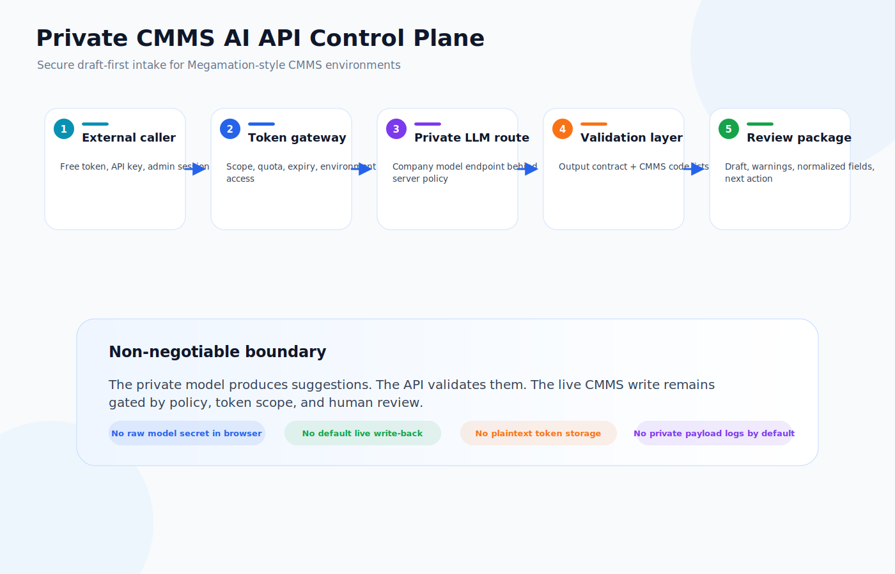
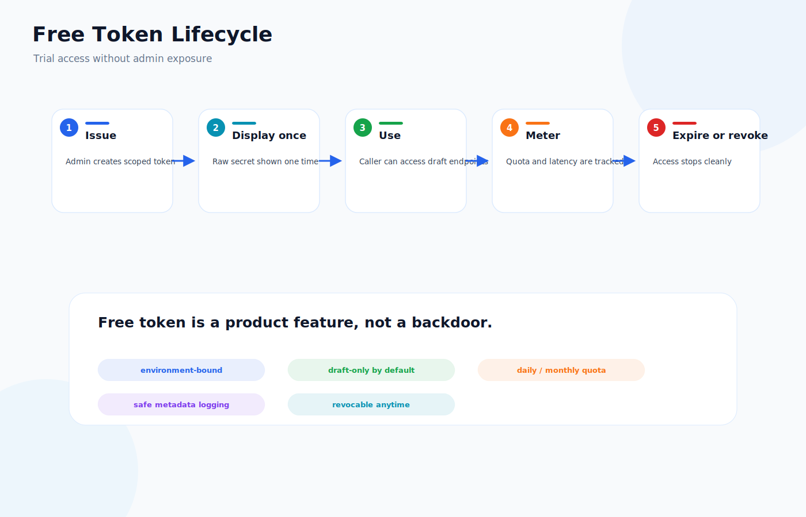
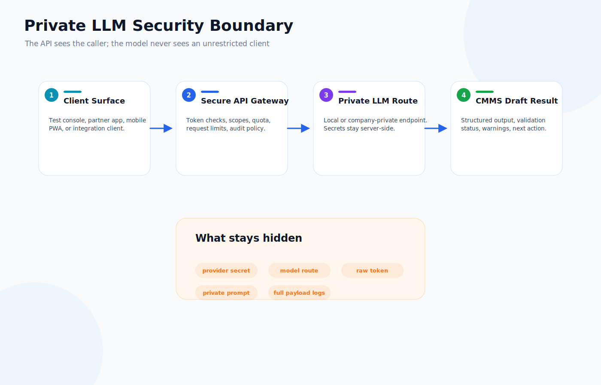
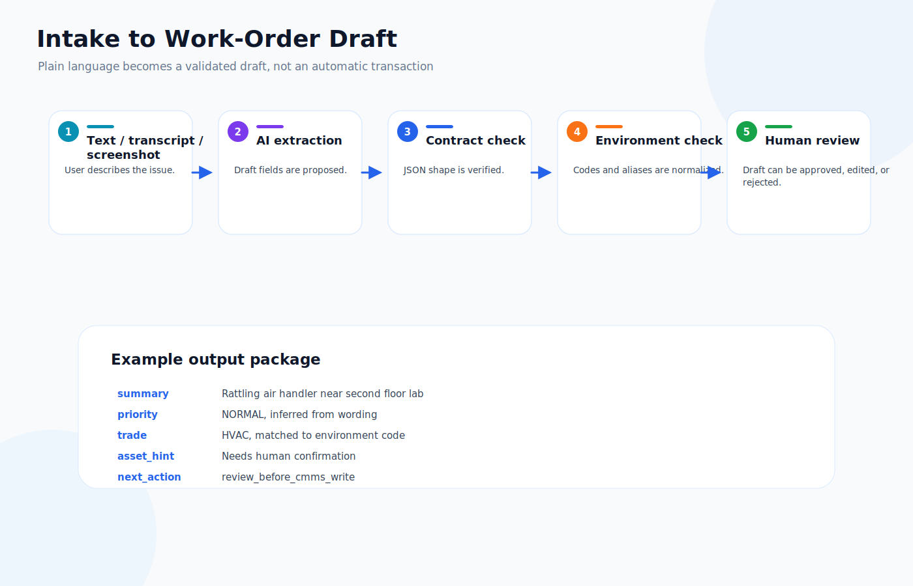
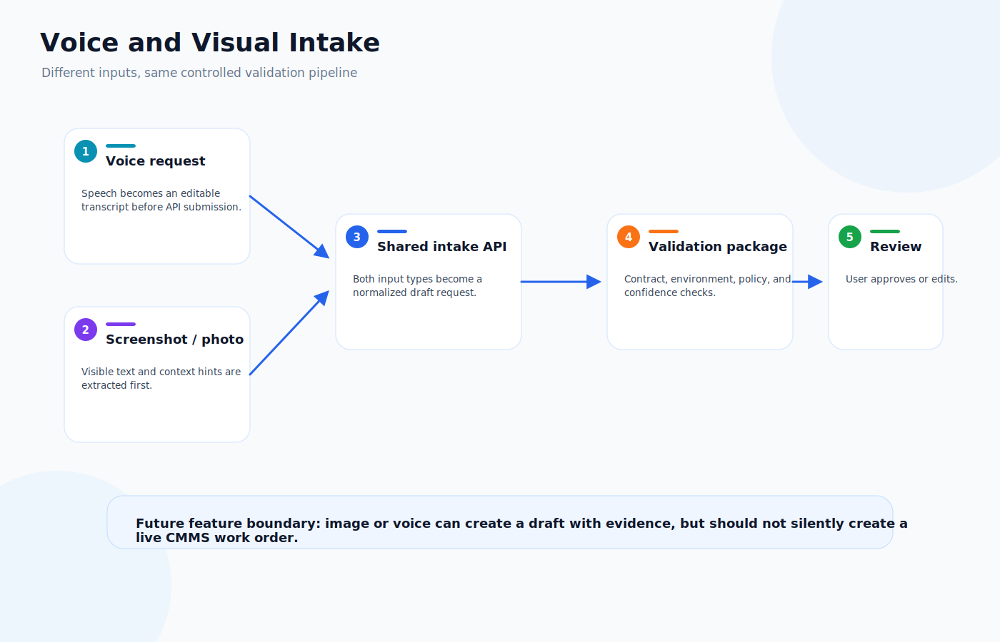
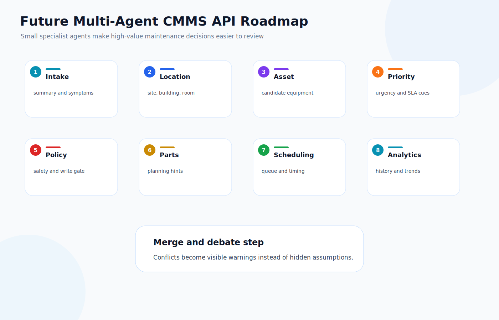
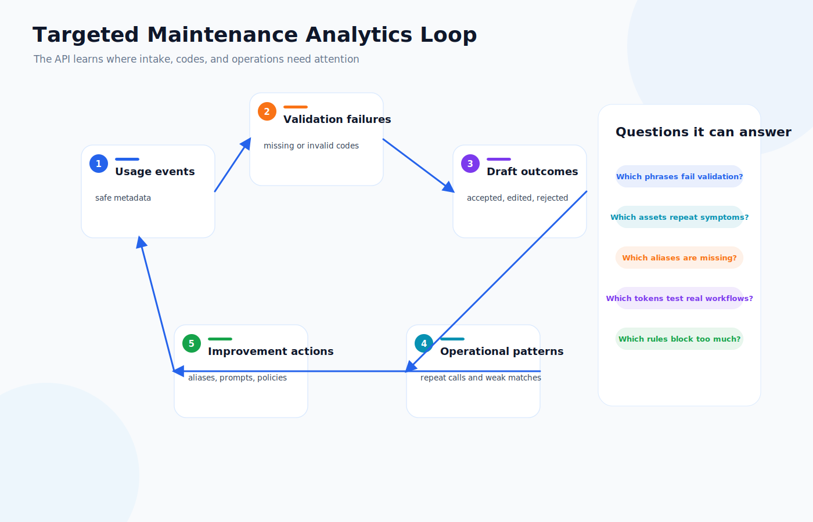
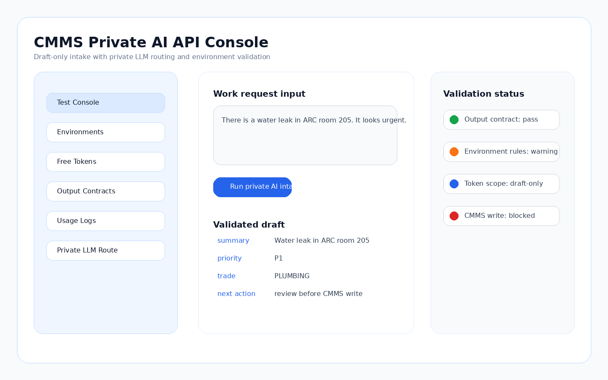
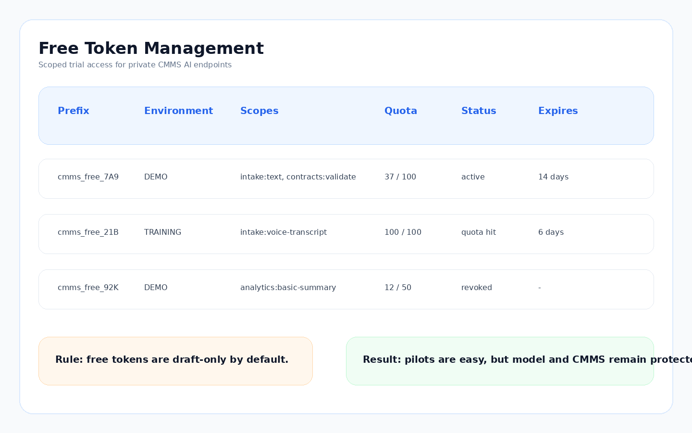
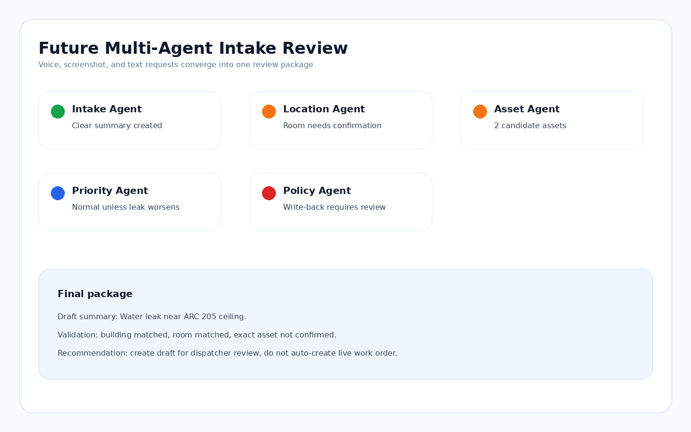

# Megamation CMMS SAGE API Showcase

A public-safe technical showcase for a secure CMMS AI API control plane.

The project shows how a maintenance organization can test AI-assisted work-request intake without sending private operating data to a public chatbot and without letting raw model output write directly into a CMMS.

The short version:

> A technician, customer, or dispatcher can describe a problem in plain language. The API extracts a work-order draft, validates it against the configured CMMS environment, checks output contracts, records safe audit metadata, and returns a reviewable result. Future versions can route the request through multiple specialist agents before a human approves the final action.

This repository is written as a portfolio-ready case study. It avoids production URLs, customer names, raw API keys, private prompts, real work orders, tenant identifiers, and proprietary CMMS records.

---

## What this project demonstrates

This is not just a prompt demo. The value is the control layer around the model.

| Area | What it shows |
| --- | --- |
| Private LLM API | A company-controlled model route for CMMS intake and validation experiments. |
| Free token access | A safe demo token model with scopes, quotas, expiry, revocation, and audit metadata. |
| CMMS environment validation | Code lists and rules that keep extracted fields aligned with each site or client setup. |
| Output contracts | Schema checks before business validation runs. |
| Voice intake | A future path where customers or technicians speak a request and receive a validated work-order draft. |
| Screenshot intake | A future path where uploaded screenshots, photos, or UI captures become structured maintenance drafts. |
| Multi-agent roadmap | Specialist agents for intake, asset context, priority, safety, parts, scheduling, and analytics. |
| Targeted analytics | API-level hooks for focused maintenance insights rather than generic chatbot answers. |
| Secure operations | Server-side model routing, sanitized logs, token hashing, least-privilege scopes, and no automatic write-back. |

---

## Architecture at a glance



The API is built around a simple rule:

> The model may suggest. The API must validate. The CMMS write must remain controlled.

The browser or external caller does not receive model provider secrets. Requests pass through a gateway that checks token scope, tenant or environment access, quota, output contract, validation rules, and logging policy before any result is returned.

---

## Why free token access matters

A private AI API is hard to evaluate if every test requires manual setup. A controlled free-token layer makes pilots easier while keeping the system safe.



A free token is not an unrestricted admin key. It is a scoped trial key:

- It can be limited to one environment.
- It can expire automatically.
- It can carry a daily or monthly request quota.
- It can be restricted to read-only and draft-only endpoints.
- It can be revoked without touching the model backend.
- It can log safe metadata without storing private request text.

This is useful for sales demos, internal pilots, client onboarding, field testing, and proof-of-concept work with a private company LLM.

---

## Private LLM routing



The model route can point to a local runtime, a private GPU server, a secured company model endpoint, or a vendor-hosted private deployment. The important part is the boundary:

- Browser and external clients call the CMMS AI API, not the model directly.
- Model endpoint secrets stay server-side.
- The API redacts sensitive fields before logs are written.
- Model names and backend routes do not need to appear in the public UI.
- Prompts, templates, and contracts can be versioned and tested before promotion.

For a Megamation-style CMMS environment, this allows AI intake to stay close to existing controlled fields such as site, building, area, asset, priority, trade, work type, assign-to group, issue-to group, and job category.

---

## Work-order draft flow



Example input:

```text
The air handler near the second floor lab is making a loud rattling noise.
It started after lunch and the room is getting warm.
```

Example API result:

```json
{
  "draft_type": "work_request",
  "summary": "Air handler near second floor lab is rattling and the room is warming up.",
  "priority": "NORMAL",
  "trade": "HVAC",
  "asset_hint": "air handler",
  "location_hint": "second floor lab",
  "confidence": 0.82,
  "validation": {
    "contract_valid": true,
    "environment_valid": true,
    "warnings": ["Exact asset match requires human confirmation."]
  },
  "next_action": "review_before_cmms_write"
}
```

The returned object is a draft. It is not an automatic work order. A dispatcher, technician, or supervisor can review the result before writing to the live CMMS.

---

## Voice and screenshot intake

The future intake surface should support more than typing.



Good future paths:

- A customer speaks into a phone: “There is water leaking from the ceiling near Room 205.”
- A technician uploads a screenshot of a fault panel.
- A supervisor uploads a photo of a damaged component.
- A dispatcher pastes a helpdesk email.
- A customer support user uploads a web form capture.

All of these should converge into the same safe pipeline: extraction, contract validation, environment validation, review package, and controlled write-back.

---

## Multi-agent direction



The first version can use one model call plus deterministic validation. The stronger future version uses multiple narrow agents:

| Agent | Responsibility |
| --- | --- |
| Intake Agent | Turns messy text, voice transcript, or image-derived text into a clear request. |
| Location Agent | Maps building, room, area, and site hints to valid CMMS codes. |
| Asset Agent | Suggests likely asset records and warns when the match is weak. |
| Priority Agent | Checks urgency, safety wording, SLA cues, and duplicate reports. |
| Policy Agent | Blocks unsafe automation and applies site-specific rules. |
| Parts Agent | Estimates likely parts or materials for planning, not automatic issue. |
| Scheduling Agent | Suggests trade, shift, queue, and follow-up timing. |
| Analytics Agent | Connects the request to failure history, backlog, downtime, and repeat issues. |

The point of multi-agent design is not to make the system complicated. The point is to keep each decision small, checkable, and explainable.

---

## Targeted data intelligence



A private CMMS AI API becomes more valuable when it can answer targeted operational questions, for example:

- “Which assets keep generating noise complaints after PM?”
- “Which locations have repeated HVAC comfort calls?”
- “Which work types are often misclassified at intake?”
- “Which buildings need better code-list aliases?”
- “Which free-token users are testing the most useful scenarios?”
- “Which draft fields fail validation most often?”

This is different from a generic dashboard. It is a feedback loop: intake requests reveal where data quality, code lists, asset naming, training, and maintenance planning need improvement.

---

## Sanitized console mockups

These images are synthetic public-safe mockups. They show the intended workflow without exposing production data, real tokens, private model names, or customer records.








---

## Repository structure

```text
.
|-- README.md
|-- PAPER.md
|-- docs/
|   |-- architecture.md
|   |-- free-token-access-model.md
|   |-- private-llm-security.md
|   |-- cmms-validation-contracts.md
|   |-- voice-and-visual-intake.md
|   |-- multi-agent-roadmap.md
|   |-- targeted-analytics.md
|   |-- api-design.md
|   |-- deployment-runbook.md
|   |-- portfolio-notes.md
|   `-- source-code-map.md
|-- assets/
|   `-- *.svg
|-- screenshots/
|   `-- *.png
|-- src/
|   |-- free_token_policy.py
|   |-- secure_logger.py
|   |-- contract_validator.py
|   |-- environment_validator.py
|   |-- private_llm_gateway.py
|   |-- agent_orchestrator.py
|   |-- analytics_router.py
|   |-- intake_pipeline.py
|   `-- demo.py
|-- data/
|   |-- sample_environment.json
|   |-- sample_requests.json
|   `-- sample_tokens.json
`-- tests/
    `-- test_showcase.py
```

---

## Run the showcase examples

The examples use only the Python standard library.

```bash
python -m unittest discover -s tests
python src/demo.py
```

The demo runs a local, deterministic mock pipeline. It does not call a real model endpoint, write to a CMMS, or require a secret.

---

## Portfolio summary

> Built a secure CMMS AI API control plane for Megamation-style work-request intake. The system demonstrates free-token onboarding, private LLM routing, environment-specific validation, output contracts, usage logging, and human-reviewed work-order drafts. The roadmap extends the same pipeline to voice intake, screenshot intake, multi-agent validation, and targeted maintenance analytics while keeping model secrets server-side and preventing raw AI output from writing directly to the CMMS.

---

## Public safety note

This repository is a public-safe showcase. It does not include private Megamation configuration, production model routes, real API keys, customer records, private work orders, tenant identifiers, screenshots from private systems, or prompt logs with operational content.
